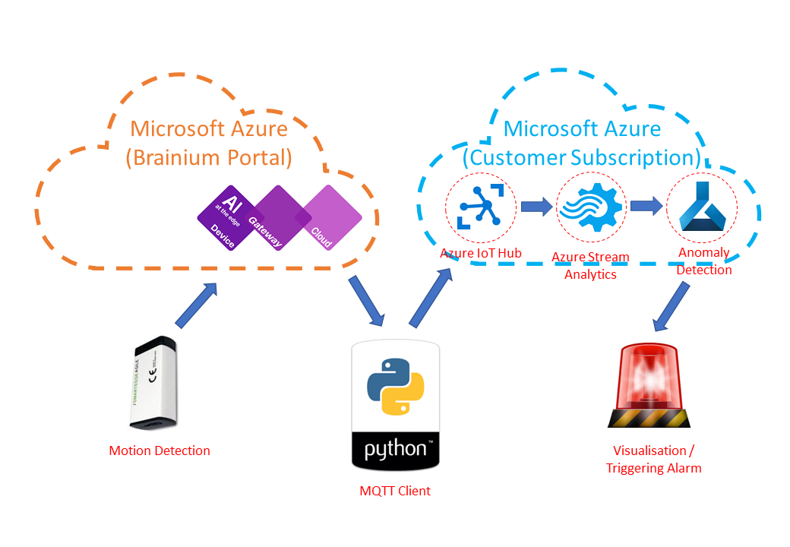
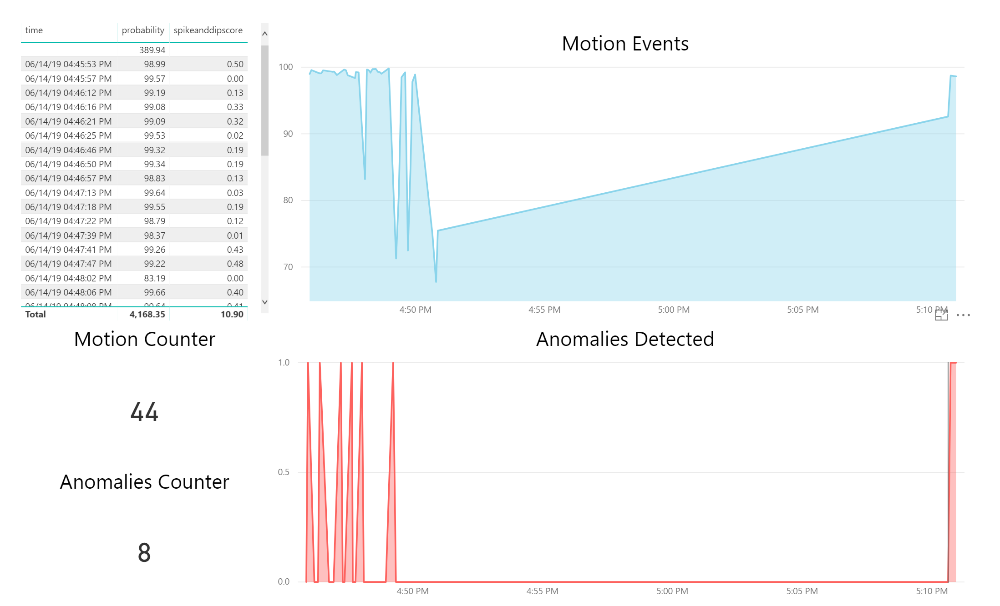

# SmartEdge Agile: API data Retrieval and Upload into Azure IoT Hub + Stream Analytics for Anomaly Detection
## Pre-requisites:
- You should have access to SmartEdge Agile from [AVNet](https://www.avnet.com/wps/portal/us/solutions/iot/building-blocks/smartedge-agile)
- You should train the model in [Brainium portal](https://www.brainium.com/) and deploy them to SmartEdge Agile device;
- You should also have smartphone or Raspberry Pi with Brainium Gateway app installed to enable data streaming from device over to the portal
## High-Level Architecture

## MQTT Client
Machine Learning at the edge to recognise gestures and enable smart manufacturing's QA control

## PowerBI Dashboard
Once you get data in PowerBI, you can create a new report and publish it in a dashboard.

This results shows the motions detected overtime, and detect anomalies in the peaks and drops.
## Working model
You can find short demo of working solution here on [YouTube](https://youtu.be/n5GvrZQTSfs)
